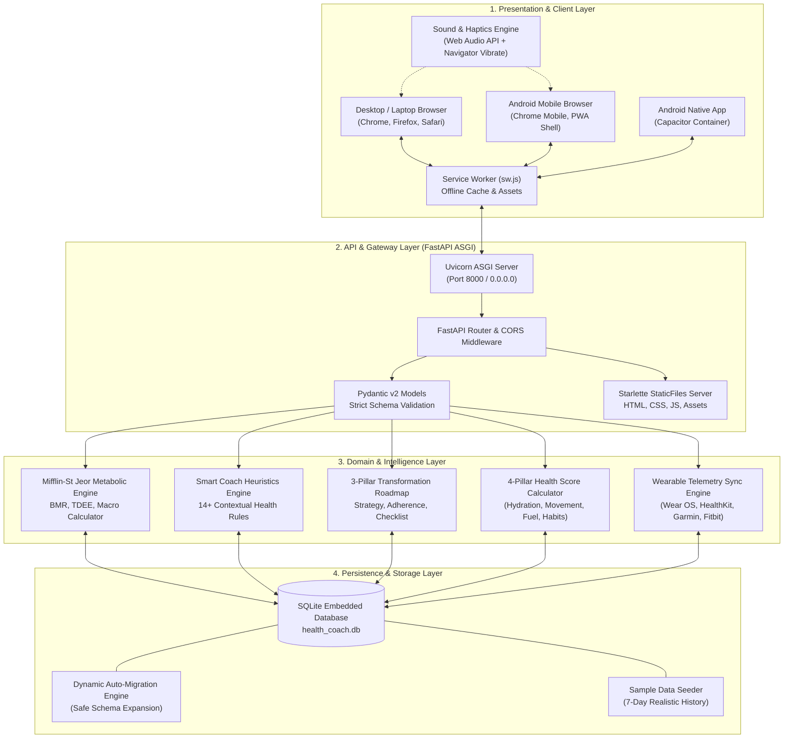
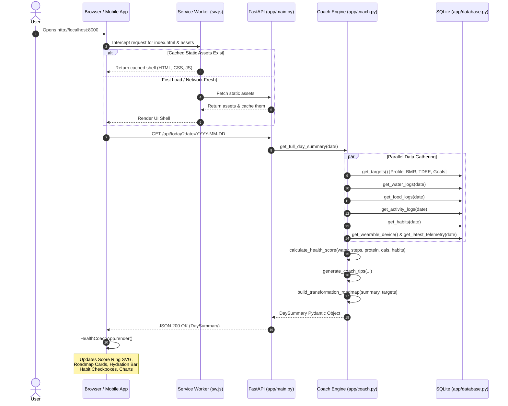
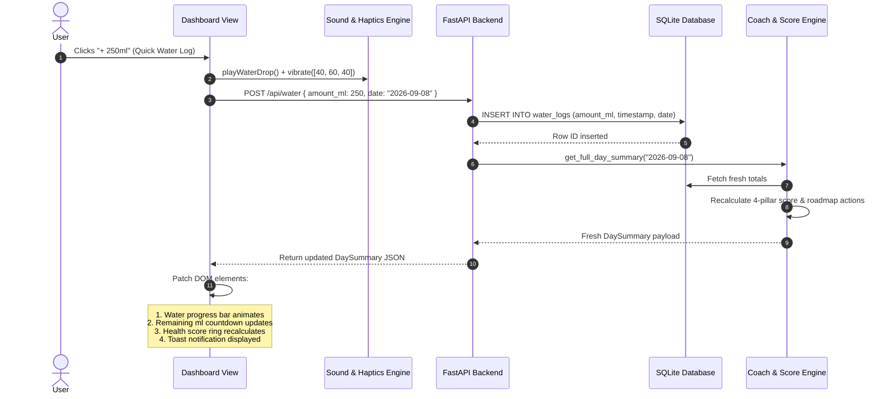
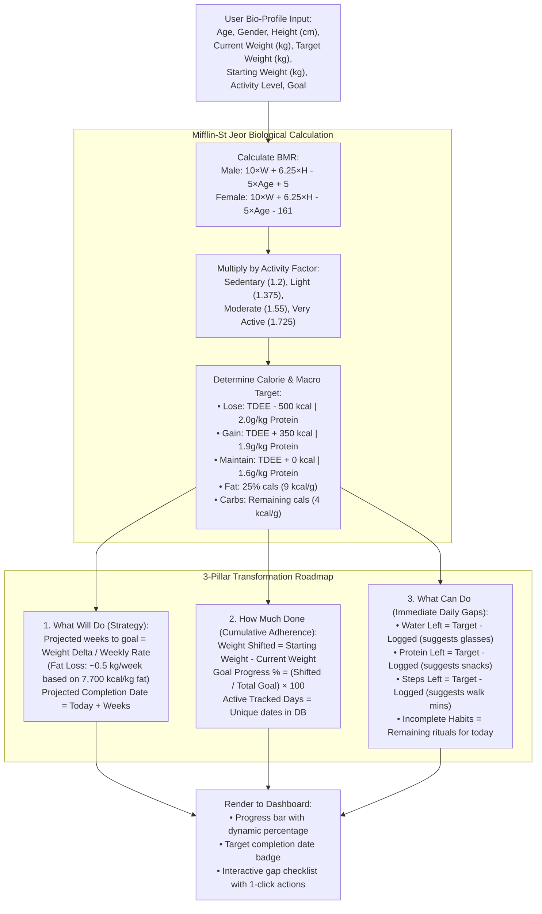
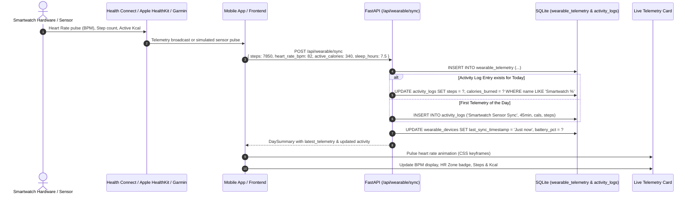
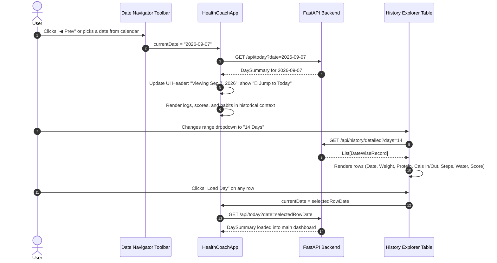
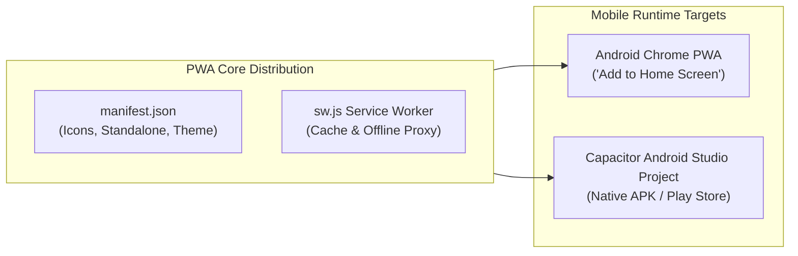

# 🌿 Daily Health Coach — System Architecture & Complete Flow Documentation

> **Publication-Grade Technical Specification & Architectural Reference**  
> **Version:** 1.0.0  
> **Status:** Production-Ready  
> **Core Stack:** Python 3.10+ (FastAPI, SQLite, Pydantic v2), Vanilla ES6+ JavaScript, Responsive CSS3, PWA / Capacitor  

---

## 📑 Table of Contents
1. [Executive Summary & Core Principles](#1-executive-summary--core-principles)
2. [High-Level System Architecture](#2-high-level-system-architecture)
3. [End-to-End Execution & Data Flows](#3-end-to-end-execution--data-flows)
   - [3.1 Day Initialization & Initial Page Load Flow](#31-day-initialization--initial-page-load-flow)
   - [3.2 User Interaction & Reactive State Mutation Flow](#32-user-interaction--reactive-state-mutation-flow)
   - [3.3 Metabolic Engine & Transformation Roadmap Flow](#33-metabolic-engine--transformation-roadmap-flow)
   - [3.4 Smartwatch Live Telemetry Synchronization Flow](#34-smartwatch-live-telemetry-synchronization-flow)
   - [3.5 Historical Date Navigation & Detailed Analytics Flow](#35-historical-date-navigation--detailed-analytics-flow)
4. [Component Deep Dive](#4-component-deep-dive)
   - [4.1 Backend Services (`app/`)](#41-backend-services-app)
   - [4.2 Frontend Architecture (`static/`)](#42-frontend-architecture-static)
5. [Database Architecture & Entity Relationship Diagram (ERD)](#5-database-architecture--entity-relationship-diagram-erd)
6. [Mathematical & Algorithmic Specifications](#6-mathematical--algorithmic-specifications)
   - [6.1 Mifflin-St Jeor Metabolic Model](#61-mifflin-st-jeor-metabolic-model)
   - [6.2 3-Pillar Transformation Roadmap Algorithm](#62-3-pillar-transformation-roadmap-algorithm)
   - [6.3 4-Pillar Composite Health Score Engine](#63-4-pillar-composite-health-score-engine)
7. [Comprehensive REST API Reference](#7-comprehensive-rest-api-reference)
8. [Multi-Resolution & Responsive UI Architecture](#8-multi-resolution--responsive-ui-architecture)
9. [Android Mobile & Progressive Web App (PWA) Ecosystem](#9-android-mobile--progressive-web-app-pwa-ecosystem)
10. [Production Server Setup, Deployment & Operations](#10-production-server-setup-deployment--operations)

---

## 1. Executive Summary & Core Principles

**Daily Health Coach** is an open-source, local-first, privacy-centric health, nutrition, and lifestyle optimization platform. It bridges the gap between passive wearable trackers and active, personalized health coaching by synthesizing biological heuristics, metabolic physics, and daily habit psychology into an actionable interface.

```
       ┌────────────────────────────────────────────────────────┐
       │                 DAILY HEALTH COACH                     │
       │                                                        │
       │   [ 🔒 100% Private ]  [ ⚡ Local-First ]  [ 🔬 MSJ ]  │
       │   All data stays on    Runs on local       Mifflin-St  │
       │   your hardware. No    server, Raspberry   Jeor bio-   │
       │   telemetry tracking.  Pi, or private VPS. energetics. │
       └────────────────────────────────────────────────────────┘
```

### Core Architectural Principles
1. **Zero Cloud Lock-In & Absolute Privacy**: No third-party analytics trackers, external database subscriptions, or proprietary API dependencies. All biometrics, weigh-ins, and journal entries are stored strictly in a local SQLite database (`health_coach.db`).
2. **Biological & Energetic Fidelity**: Rather than using arbitrary calorie targets, the system computes Basal Metabolic Rate (BMR) and Total Daily Energy Expenditure (TDEE) using the scientifically validated **Mifflin-St Jeor equation**, factoring in biological age, gender, height, current weight, and activity multipliers.
3. **Pillar-Based Holistic Health Scoring**: Health is not measured solely by steps or calories. The system computes a composite **Daily Health Score (0–100)** across four distinct 25-point pillars: **Hydration**, **Movement**, **Fuel (Protein & Caloric Balance)**, and **Micro-Habits**.
4. **Unified Multi-Device Architecture**: A single, clean codebase serves high-performance desktop dashboards (1920×1080 and ultrawide), compact laptop displays (1280×589), tablets (768×1024), and native-feeling Android mobile applications (360×740, 390×844) via Progressive Web App (PWA) and Capacitor wrappers.

---

## 2. High-Level System Architecture

The system is organized into four clearly separated architectural layers:



---

## 3. End-to-End Execution & Data Flows

### 3.1 Day Initialization & Initial Page Load Flow

When a user opens the application (or switches the target date), the client requests the aggregated day summary. The server collates all sub-entities, executes coaching heuristics, calculates the metabolic roadmap, and delivers a reactive payload.



---

### 3.2 User Interaction & Reactive State Mutation Flow

Every user action—such as logging a glass of water, adding a meal, logging an activity, or checking a habit—follows an optimistic, transactional roundtrip that automatically recalculates scores and updates the UI without requiring a full page refresh.



---

### 3.3 Metabolic Engine & Transformation Roadmap Flow

The Transformation Roadmap provides answers to three questions:
1. **What Will Do**: The scientific strategy (caloric deficit/surplus, daily protein quota, projected target date).
2. **How Much Done**: Measured progress from the starting weight toward the goal weight, with percentage completion.
3. **What Can Do**: A real-time checklist identifying current gaps for the day.



---

### 3.4 Smartwatch Live Telemetry Synchronization Flow

Daily Health Coach supports real-time telemetry synchronization with smartwatches and fitness bands (Samsung Galaxy Watch, Apple Watch, Garmin, Fitbit, and Google Wear OS).



---

### 3.5 Historical Date Navigation & Detailed Analytics Flow

Users can explore their historical performance date-by-date or analyze multi-day trends in the comprehensive **Date-Wise Tracking & History Explorer**.



---

## 4. Component Deep Dive

### 4.1 Backend Services (`app/`)

| File | Primary Responsibility | Key Classes / Functions | Lines of Code |
| :--- | :--- | :--- | :--- |
| [`app/main.py`](file:///home/ranjith/.gemini/antigravity-ide/scratch/daily-health-coach/app/main.py) | **ASGI Gateway & Routing**: Handles HTTP routes, lifespan startup/shutdown, CORS policies, static file mounting, PWA manifest and service worker delivery. | `app = FastAPI()`, `lifespan()`, `get_today_summary()`, `log_water()`, `log_food()`, `log_activity()`, `toggle_habit()`, `calculate_metabolism()`, `sync_wearable()`, `serve_index()` | 351 |
| [`app/models.py`](file:///home/ranjith/.gemini/antigravity-ide/scratch/daily-health-coach/app/models.py) | **Pydantic v2 Data Transfer Objects**: Validates and serializes all API payloads, setting strict bounds, type enforcement, and default values. | `Targets`, `WaterLogCreate`, `FoodLogCreate`, `ActivityLogCreate`, `WeightLogCreate`, `HabitItem`, `CoachTip`, `DaySummary`, `TransformationRoadmap`, `RoadmapActionItem`, `DateWiseRecord`, `WatchTelemetry`, `WearableDevice` | 239 |
| [`app/database.py`](file:///home/ranjith/.gemini/antigravity-ide/scratch/daily-health-coach/app/database.py) | **Persistence & Schema Layer**: Direct SQLite connection management, schema initialization, auto-migrations, and transactional CRUD operations. | `get_connection()`, `init_db()`, `get_targets()`, `update_targets()`, `add_water_log()`, `add_food_log()`, `add_activity_log()`, `ensure_habits_for_date()`, `toggle_habit()`, `record_watch_telemetry()`, `log_weight()`, `get_detailed_history()` | 661 |
| [`app/coach.py`](file:///home/ranjith/.gemini/antigravity-ide/scratch/daily-health-coach/app/coach.py) | **Domain Logic & Intelligence Engine**: Implements the Mifflin-St Jeor metabolic formula, 4-pillar health score algorithm, 14+ contextual coaching heuristics, roadmap builder, and historical aggregator. | `calculate_metabolism()`, `calculate_health_score()`, `generate_coach_tips()`, `build_transformation_roadmap()`, `get_full_day_summary()`, `get_detailed_history()` | 681 |
| [`app/seed_data.py`](file:///home/ranjith/.gemini/antigravity-ide/scratch/daily-health-coach/app/seed_data.py) | **Realistic Data Seeder**: Generates 7 days of realistic historical workouts, meals, hydration events, discipline streaks, and weigh-in trends. | `seed_database(force=False)` | 148 |

---

### 4.2 Frontend Architecture (`static/`)

The frontend is constructed using native web standards—**Zero heavy framework overhead**, lightning-fast rendering, and complete offline capability.

| Module | File Path | Functional Role | Key Capabilities |
| :--- | :--- | :--- | :--- |
| **HTML UI Shell** | [`static/index.html`](file:///home/ranjith/.gemini/antigravity-ide/scratch/daily-health-coach/static/index.html) | Semantic Markup & Accessibility | Semantic HTML5 tags, SVG score ring, modal containers, ARIA accessibility attributes, Android phone frame wrapper. |
| **Design System Tokens** | [`static/css/design-system.css`](file:///home/ranjith/.gemini/antigravity-ide/scratch/daily-health-coach/static/css/design-system.css) | Core Tokens & Variables | Curated dark mode color palette (`--bg-primary`, `--accent-emerald`, `--accent-azure`, `--accent-amber`), glassmorphism properties, typography scale. |
| **Layout & Grid Engine** | [`static/css/layout.css`](file:///home/ranjith/.gemini/antigravity-ide/scratch/daily-health-coach/static/css/layout.css) | Responsive Grid & Scaffolding | Responsive dashboard grid (`repeat(auto-fit, minmax(280px, 1fr))`), mobile media queries, Android phone simulator frame. |
| **Component Styles** | [`static/css/components.css`](file:///home/ranjith/.gemini/antigravity-ide/scratch/daily-health-coach/static/css/components.css) | Widgets, Modals & Sheets | Modal dialogs, bottom-sheet transforms for mobile, History Explorer table with sticky headers, progress bars, toast notification animations. |
| **API Client** | [`static/js/api.js`](file:///home/ranjith/.gemini/antigravity-ide/scratch/daily-health-coach/static/js/api.js) | Network Layer & Error Handling | Fetch wrapper with timeout handling, standardized error catching, and automatic JSON serialization. |
| **Application Controller** | [`static/js/app.js`](file:///home/ranjith/.gemini/antigravity-ide/scratch/daily-health-coach/static/js/app.js) | Central State & DOM Reactivity | `HealthCoachApp` class: manages `AppState`, event binding, modal interactions, date navigation, live countdown timer, and toast notifications. |
| **Trend Visualizer** | [`static/js/charts.js`](file:///home/ranjith/.gemini/antigravity-ide/scratch/daily-health-coach/static/js/charts.js) | Dynamic Canvas Trend Charts | High-performance HTML5 canvas chart rendering daily health scores, steps, and water volume without heavy external charting libraries. |
| **Audio & Haptic Feedback** | [`static/js/sound.js`](file:///home/ranjith/.gemini/antigravity-ide/scratch/daily-health-coach/static/js/sound.js) | Native Sensory Feedback | Synthesizes sound frequencies via the Web Audio API (water chime, habit success, alert chime) and calls `navigator.vibrate()` on mobile devices. |
| **PWA Service Worker** | [`static/sw.js`](file:///home/ranjith/.gemini/antigravity-ide/scratch/daily-health-coach/static/sw.js) | Offline Interception & Cache | Cache-first for static CSS/JS/fonts, network-first with cache fallback for API endpoints. |
| **PWA Manifest** | [`static/manifest.json`](file:///home/ranjith/.gemini/antigravity-ide/scratch/daily-health-coach/static/manifest.json) | Android Installation Metadata | Defines app icons, `display: standalone`, orientation, and theme color for home screen installation. |

---

## 5. Database Architecture & Entity Relationship Diagram (ERD)

The persistence layer uses an embedded SQLite database (`health_coach.db`). It features safe auto-migrations: if a table exists but lacks newly added columns, the startup lifecycle gracefully executes non-destructive `ALTER TABLE ADD COLUMN` statements.

```mermaid
erDiagram
    TARGETS ||--o{ WEIGHT_LOGS : tracks
    TARGETS {
        int id PK "Always 1"
        int water_target_ml "Default 2500"
        int steps_target "Default 10000"
        int calories_target "Default 2100"
        int protein_target_g "Default 130"
        int carbs_target_g "Default 220"
        int fat_target_g "Default 65"
        real sleep_target_hours "Default 8.0"
        real current_weight_kg "Default 78.5"
        real height_cm "Default 175.0"
        real target_weight_kg "Default 72.0"
        real starting_weight_kg "Default 80.0"
        int age "Default 28"
        text gender "Male / Female / Other"
        text fitness_goal "Lose / Gain / Maintain"
        text activity_level "Sedentary to Very Active"
        int bmr_kcal "Calculated BMR"
        int tdee_kcal "Calculated TDEE"
        int water_reminder_interval_min "Default 60"
        timestamp updated_at
    }

    WATER_LOGS {
        int id PK "Autoincrement"
        int amount_ml "Volume logged"
        text timestamp "e.g. 10:30 AM"
        text date "YYYY-MM-DD"
        text note "Optional context"
        timestamp created_at
    }

    FOOD_LOGS {
        int id PK "Autoincrement"
        text name "Meal name"
        text meal_type "Breakfast/Lunch/Dinner/Snack"
        int calories "Total kcal"
        real protein_g "Protein in grams"
        real carbs_g "Carbs in grams"
        real fat_g "Fat in grams"
        text timestamp "Time logged"
        text date "YYYY-MM-DD"
        timestamp created_at
    }

    ACTIVITY_LOGS {
        int id PK "Autoincrement"
        text name "Workout or walk name"
        int duration_min "Active duration"
        int calories_burned "Energy expended"
        int steps "Pedometer steps"
        text intensity "Low / Moderate / High"
        text timestamp "Time recorded"
        text date "YYYY-MM-DD"
        timestamp created_at
    }

    HABITS {
        text id PK "Compound PK"
        text date PK "Compound PK"
        text title "Habit description"
        text category "Discipline / Morning / etc"
        text icon "Emoji icon"
        int completed "0 or 1"
        int streak_count "Consecutive days"
    }

    WEARABLE_DEVICES {
        int id PK "Always 1"
        text brand "Samsung / Apple / Garmin / Fitbit"
        text model_name "Watch model"
        text provider "Health Connect / HealthKit"
        int is_connected "0 or 1"
        int battery_pct "Current battery level"
        text last_sync_timestamp "Time of last sync"
        timestamp updated_at
    }

    WEARABLE_TELEMETRY {
        int id PK "Autoincrement"
        int heart_rate_bpm "Current HR"
        int resting_hr "Resting baseline HR"
        text hr_zone "Resting / Fat Burn / Cardio / Peak"
        int steps "Sensor step counter"
        int active_calories "Sensor calorie burn"
        real sleep_hours "Sleep duration"
        int sleep_quality_pct "Sleep score"
        int battery_pct "Watch battery"
        text timestamp "Time of telemetry"
        text date "YYYY-MM-DD"
        timestamp created_at
    }

    WEIGHT_LOGS {
        int id PK "Autoincrement"
        real weight_kg "Logged weight in kg"
        text date "YYYY-MM-DD"
        text timestamp "Time of weigh-in"
        text note "Optional morning note"
        timestamp created_at
    }

    USER_META {
        text key PK "Metadata key"
        text value "Metadata value"
    }
```



---

## 6. Mathematical & Algorithmic Specifications

### 6.1 Mifflin-St Jeor Metabolic Model

The metabolic engine calculates the human body's Basal Metabolic Rate ($BMR$) and Total Daily Energy Expenditure ($TDEE$) using the Mifflin-St Jeor formula:

$$\text{BMR} = 10 \times \text{weight (kg)} + 6.25 \times \text{height (cm)} - 5 \times \text{age (years)} + s$$

Where the biological sex constant $s$ is:
- **Male:** $s = +5$
- **Female:** $s = -161$
- **Other / Neutral:** $s = -78$

#### Activity Multipliers:
$$\text{TDEE} = \text{BMR} \times \text{Multiplier}$$
- **Sedentary:** $1.2$ (little to no exercise, desk job)
- **Lightly Active:** $1.375$ (light exercise 1–3 days/week)
- **Moderately Active:** $1.55$ (moderate exercise 3–5 days/week)
- **Very Active:** $1.725$ (hard exercise 6–7 days/week)

#### Goal Caloric & Macronutrient Allocations:
- **Weight Loss (Fat Loss):**
  $$\text{Calorie Budget} = \max(1200, \text{TDEE} - 500\text{ kcal})$$
  $$\text{Target Protein} = 2.0\text{ g} \times \text{weight (kg)}$$
- **Weight Gain (Muscle Hypertrophy):**
  $$\text{Calorie Budget} = \text{TDEE} + 350\text{ kcal}$$
  $$\text{Target Protein} = 1.9\text{ g} \times \text{weight (kg)}$$
- **Maintenance (Body Recomposition):**
  $$\text{Calorie Budget} = \text{TDEE}$$
  $$\text{Target Protein} = 1.6\text{ g} \times \text{weight (kg)}$$
- **Fat Allotment:** $25\%$ of total daily calories ($\div 9\text{ kcal/g}$).
- **Carbohydrate Allotment:** Remaining daily calories ($\div 4\text{ kcal/g}$).

---

### 6.2 3-Pillar Transformation Roadmap Algorithm

1. **Strategic Projections**:
   - Fat contains approximately $7,700\text{ kcal}$ per kilogram of adipose tissue. A daily deficit of $500\text{ kcal}$ yields:
     $$\text{Weekly Fat Loss Rate} \approx \frac{500 \times 7}{7,700} = 0.45\text{ to }0.50\text{ kg/week}$$
   - Projected weeks to goal:
     $$\text{Weeks to Goal} = \frac{|\text{Current Weight} - \text{Target Weight}|}{\text{Weekly Rate}}$$
   - Projected completion date:
     $$\text{Target Date} = \text{Current Date} + \text{Weeks to Goal}$$

2. **Cumulative Adherence**:
   - Weight shifted from baseline:
     $$\text{Weight Shifted} = |\text{Starting Weight} - \text{Current Weight}|$$
   - Total goal shift required:
     $$\text{Total Shift Required} = |\text{Starting Weight} - \text{Target Weight}|$$
   - Goal completion percentage:
     $$\text{Adherence \%} = \min\left(100, \max\left(0, \frac{\text{Weight Shifted}}{\text{Total Shift Required}} \times 100\right)\right)$$

3. **Dynamic Daily Action Checklist**:
   $$\Delta_{\text{Water}} = \text{Target}_{\text{Water}} - \text{Logged}_{\text{Water}}$$
   $$\Delta_{\text{Protein}} = \text{Target}_{\text{Protein}} - \text{Logged}_{\text{Protein}}$$
   $$\Delta_{\text{Steps}} = \text{Target}_{\text{Steps}} - \text{Logged}_{\text{Steps}}$$
   - When $\Delta > 0$, an actionable card is generated with immediate suggestions (e.g. number of 250ml cups to drink, protein snacks, or walking minutes needed).

---

### 6.3 4-Pillar Composite Health Score Engine

The Daily Health Score ($0 \le S \le 100$) synthesizes performance across four 25-point categories:

$$S = S_{\text{Hydration}} + S_{\text{Movement}} + S_{\text{Fuel}} + S_{\text{Habits}}$$

1. **Hydration Pillar ($0$–$25$ pts):**
   $$S_{\text{Hydration}} = \text{round}\left(\min(1.0, \frac{\text{Water Logged}}{\text{Water Target}}) \times 25\right)$$

2. **Movement Pillar ($0$–$25$ pts):**
   $$S_{\text{Movement}} = \text{round}\left(\min(1.0, \frac{\text{Steps Counted}}{\text{Steps Target}}) \times 25\right)$$

3. **Nutrition & Fuel Pillar ($0$–$25$ pts):**
   $$P_{\text{ratio}} = \min(1.0, \frac{\text{Protein Logged}}{\text{Protein Target}})$$
   $$\text{Penalty}_{\text{Calorie}} = \begin{cases} 5, & \text{if } \text{Calories Consumed} > 1.25 \times \text{Calorie Target} \\ 0, & \text{otherwise} \end{cases}$$
   $$S_{\text{Fuel}} = \max(0, \text{round}(P_{\text{ratio}} \times 25) - \text{Penalty}_{\text{Calorie}})$$

4. **Micro-Habits Pillar ($0$–$25$ pts):**
   $$S_{\text{Habits}} = \text{round}\left(\frac{\text{Habits Completed}}{\text{Habits Total}} \times 25\right)$$

#### Score Classifications:
- **90 – 100:** *Elite Consistency* 🏆
- **75 – 89:** *On Track & Thriving* 🌟
- **55 – 74:** *Building Momentum* ⚡
- **0 – 54:** *Needs a Daily Push* 🎯

---

## 7. Comprehensive REST API Reference

All endpoints accept and return JSON payloads (`application/json`). Interactive Swagger documentation is available at `http://localhost:8000/docs`.

### Core Health & Summary Endpoints

#### `GET /api/health`
- **Description:** System health check and server timestamp.
- **Response:** `{"status": "ok", "timestamp": "2026-09-08T15:45:00", "app": "Daily Health Coach"}`

#### `GET /api/today`
- **Description:** Primary aggregated payload for the dashboard. Fetches targets, logs, scores, roadmap, and coach advice for the specified date.
- **Query Parameters:** `date` *(optional, string YYYY-MM-DD, defaults to current system date)*.
- **Response Model:** `DaySummary` (HTTP 200).

---

### Tracking & Logging Endpoints

#### `POST /api/water`
- **Description:** Logs a hydration event.
- **Request Body:**
  ```json
  {
    "amount_ml": 250,
    "timestamp": "10:30 AM",
    "date": "2026-09-08",
    "note": "Morning glass"
  }
  ```
- **Response:** Updated `DaySummary` (HTTP 200).

#### `DELETE /api/water/{log_id}`
- **Description:** Deletes a specific water log entry and updates the day summary.
- **Response:** Updated `DaySummary` (HTTP 200).

#### `POST /api/food`
- **Description:** Logs a meal or snack with macronutrient details.
- **Request Body:**
  ```json
  {
    "name": "Grilled Chicken Breast with Quinoa",
    "meal_type": "Lunch",
    "calories": 480,
    "protein_g": 42.0,
    "carbs_g": 38.0,
    "fat_g": 9.5,
    "date": "2026-09-08"
  }
  ```
- **Response:** Updated `DaySummary` (HTTP 200).

#### `DELETE /api/food/{log_id}`
- **Description:** Removes a logged meal and updates daily totals.
- **Response:** Updated `DaySummary` (HTTP 200).

#### `POST /api/activity`
- **Description:** Records an exercise session or activity.
- **Request Body:**
  ```json
  {
    "name": "Brisk Outdoor Walk",
    "duration_min": 35,
    "calories_burned": 180,
    "steps": 3800,
    "intensity": "Moderate",
    "date": "2026-09-08"
  }
  ```
- **Response:** Updated `DaySummary` (HTTP 200).

#### `DELETE /api/activity/{log_id}`
- **Description:** Deletes an activity log entry.
- **Response:** Updated `DaySummary` (HTTP 200).

#### `POST /api/habits/toggle`
- **Description:** Toggles the completion status of a daily micro-habit or discipline streak.
- **Request Body:**
  ```json
  {
    "habit_id": "habit_no_fastfood",
    "date": "2026-09-08"
  }
  ```
- **Response:** Updated `DaySummary` (HTTP 200).

#### `POST /api/weight`
- **Description:** Records a body weigh-in, appends to the weight history log, and updates the active profile weight.
- **Request Body:**
  ```json
  {
    "weight_kg": 77.2,
    "date": "2026-09-08",
    "note": "Morning weigh-in before breakfast"
  }
  ```
- **Response:** Updated `DaySummary` (HTTP 200).

---

### Profile, Targets & Metabolism Endpoints

#### `GET /api/targets`
- **Description:** Retrieves the user's active biological profile, targets, and metabolic parameters.
- **Response Model:** `Targets` (HTTP 200).

#### `PUT /api/targets`
- **Description:** Updates profile metrics, macro budgets, and reminder settings.
- **Request Body:** `Targets` schema.
- **Response:** Updated `DaySummary` (HTTP 200).

#### `POST /api/metabolism/calculate`
- **Description:** Computes personalized BMR, TDEE, and macro recommendations based on user-provided biometrics without saving immediately.
- **Request Body:**
  ```json
  {
    "age": 28,
    "gender": "Male",
    "height_cm": 175.0,
    "current_weight_kg": 78.5,
    "target_weight_kg": 72.0,
    "fitness_goal": "Lose Weight",
    "activity_level": "Moderately Active"
  }
  ```
- **Response:**
  ```json
  {
    "bmr_kcal": 1720,
    "tdee_kcal": 2400,
    "recommended_calories": 1900,
    "recommended_protein_g": 157,
    "recommended_carbs_g": 190,
    "recommended_fat_g": 53,
    "deficit_or_surplus_kcal": -500,
    "goal_label": "Fat Loss & Muscle Preservation"
  }
  ```

---

### History & Detailed Explorer Endpoints

#### `GET /api/history`
- **Description:** Fetches a 7-day trend summary (scores, steps, hydration, calories, protein) for sparklines and charts.
- **Response:** `List[HistoryDay]` (HTTP 200).

#### `GET /api/history/detailed`
- **Description:** Aggregates date-wise performance records across all logged days for detailed table analysis.
- **Query Parameters:** `days` *(integer, default 14, min 1, max 90)*.
- **Response:** `List[DateWiseRecord]` (HTTP 200).

---

### Smartwatch & Wearable Integration Endpoints

#### `GET /api/wearable/status`
- **Description:** Retrieves the paired smartwatch status and latest telemetry readings.
- **Response:** `{"device": WearableDevice, "telemetry": WatchTelemetry}` (HTTP 200).

#### `POST /api/wearable/sync`
- **Description:** Ingests live sensor telemetry (steps, heart rate, active calories, sleep) from smartwatch bridges.
- **Request Body:**
  ```json
  {
    "steps": 6200,
    "heart_rate_bpm": 76,
    "active_calories": 310,
    "sleep_hours": 7.8,
    "battery_pct": 82,
    "date": "2026-09-08"
  }
  ```
- **Response:** Updated `DaySummary` (HTTP 200).

#### `POST /api/wearable/pair`
- **Description:** Updates the active paired smartwatch brand and model.
- **Request Body:**
  ```json
  {
    "brand": "Apple Watch",
    "model_name": "Series 9",
    "provider": "Apple HealthKit"
  }
  ```

#### `POST /api/wearable/simulate-pulse`
- **Description:** Simulates a live smartwatch telemetry pulse (steps increment and heart rate fluctuation) for testing.
- **Response:** Updated `DaySummary` (HTTP 200).

---

## 8. Multi-Resolution & Responsive UI Architecture

The frontend is designed to deliver a native-feeling experience across any screen size.

```
┌────────────────────────────────────────────────────────────────────────┐
│                        VIEWPORT SPECIFICATIONS                         │
├──────────────────────┬────────────────────────┬────────────────────────┤
│ Display Category     │ Resolution Targets     │ Adaptive Behaviors     │
├──────────────────────┼────────────────────────┼────────────────────────┤
│ Desktop Monitors     │ 1920×1080 (FHD), 4K    │ Full 3-column layout   │
│ Standard Laptops     │ 1280×589, 1366×768     │ Proportional cards     │
│ Tablets              │ 768×1024 (iPad / Tab)  │ 2-column stacked grid  │
│ Android Smartphones  │ 360×740, 390×844       │ Single-column stream   │
└──────────────────────┴────────────────────────┴────────────────────────┘
```

### Key Responsive Design Mechanics
1. **Container Margin & Bleed Elimination**: The layout uses a strict `width: 100%; max-width: 1360px; margin: 0 auto; box-sizing: border-box;` model. Grids adapt fluidly using `repeat(auto-fit, minmax(280px, 1fr))`, eliminating unwanted horizontal scrollbars.
2. **Modal Dialogs & Mobile Bottom Sheets**:
   - **On Desktop/Laptop**: Modals render centered with smooth scale-up animations, backdrop blur (`backdrop-filter: blur(8px)`), and a maximum height of `88vh`.
   - **On Mobile (<600px)**: Modals automatically transform into **Native Bottom Sheets** (`border-bottom-left-radius: 0; border-bottom-right-radius: 0; max-height: 90vh;`).
   - **Dismiss Interactions**: All modals support three intuitive dismiss methods:
     1. Tapping the backdrop overlay (`modal-backdrop`).
     2. Pressing the physical keyboard `Escape` key.
     3. Tapping the prominent top-right close icon (`btn-modal-close`).
3. **Table Responsiveness**: The History Explorer table is encased in an `overflow-x: auto` container with a sticky header and smooth touch scrolling for mobile devices.
4. **Touch Targets**: All buttons, checkboxes, and interactive controls maintain a minimum touch target size of $44 \times 44\text{ px}$, following Apple Human Interface and Google Material Design guidelines.

---

## 9. Android Mobile & Progressive Web App (PWA) Ecosystem

Daily Health Coach functions as a progressive web app and can be packaged into a native Android APK using Capacitor.



### 9.1 PWA Installation on Android
1. Connect your Android device to the same Wi-Fi network as the server.
2. Open **Google Chrome** and navigate to `http://<your-server-ip>:8000`.
3. Tap the **`📲 Install Android App`** button on the top navigation bar, or open Chrome's menu (`⋮`) and select **`Install app`** / **`Add to Home screen`**.
4. The application installs as a standalone app on your home screen, complete with splash screen, independent process isolation, and offline support.

### 9.2 Service Worker Caching Strategy
- **Static Assets (`/static/*`)**: *Cache-First, Network Fallback*. CSS stylesheets, JavaScript files, and icons are cached locally for immediate loading.
- **API Endpoints (`/api/*`)**: *Network-First, Cache Fallback*. Dynamic data queries the local backend first to maintain real-time accuracy, falling back gracefully to cached responses if the device temporarily disconnects.

### 9.3 Native Sensory Feedback (Sound & Vibration)
- **Audio Chimes**: Uses the **Web Audio API** to generate synthetic audio tones without loading external MP3 files.
  - Hydration Chime: Dual frequency sine-wave chord ($587.33\text{ Hz}$ to $880.0\text{ Hz}$).
  - Habit / Streak Chime: Ascending pentatonic chord ($523.25\text{ Hz} \rightarrow 659.25\text{ Hz} \rightarrow 783.99\text{ Hz}$).
- **Haptic Feedback**: Calls `navigator.vibrate([40, 60, 40])` on supported Android hardware to provide physical confirmation when logging actions.

---

## 10. Production Server Setup, Deployment & Operations

### 10.1 Bare-Metal / VPS Deployment (Ubuntu / Debian)

#### Step 1: Clone Repository and Prepare Virtual Environment
```bash
# Clone the repository
git clone https://github.com/your-username/daily-health-coach.git /var/www/daily-health-coach
cd /var/www/daily-health-coach

# Set up Python virtual environment
python3 -m venv venv
source venv/bin/activate
pip install --upgrade pip
pip install -r requirements.txt
```

#### Step 2: Systemd Service Configuration
Create a systemd unit file:
```bash
sudo nano /etc/systemd/system/daily-health-coach.service
```

```ini
[Unit]
Description=Daily Health Coach - FastAPI Application Server
After=network.target

[Service]
User=www-data
Group=www-data
WorkingDirectory=/var/www/daily-health-coach
Environment="PATH=/var/www/daily-health-coach/venv/bin"
ExecStart=/var/www/daily-health-coach/venv/bin/uvicorn app.main:app --host 0.0.0.0 --port 8000 --workers 2
Restart=always
RestartSec=5

[Install]
WantedBy=multi-user.target
```

Enable and start the service:
```bash
sudo systemctl daemon-reload
sudo systemctl enable daily-health-coach
sudo systemctl start daily-health-coach
sudo systemctl status daily-health-coach
```

---

### 10.2 Nginx Reverse Proxy with SSL (HTTPS)

```nginx
# /etc/nginx/sites-available/daily-health-coach
server {
    listen 80;
    server_name health.yourdomain.com;

    # Redirect all plain HTTP traffic to HTTPS
    return 301 https://$host$request_uri;
}

server {
    listen 443 ssl http2;
    server_name health.yourdomain.com;

    # SSL Certificates (managed via Certbot)
    ssl_certificate /etc/letsencrypt/live/health.yourdomain.com/fullchain.pem;
    ssl_certificate_key /etc/letsencrypt/live/health.yourdomain.com/privkey.pem;
    ssl_protocols TLSv1.2 TLSv1.3;
    ssl_ciphers HIGH:!aNULL:!MD5;

    # Security Headers
    add_header X-Frame-Options SAMEORIGIN;
    add_header X-Content-Type-Options nosniff;
    add_header X-XSS-Protection "1; mode=block";

    location / {
        proxy_pass http://127.0.0.1:8000;
        proxy_set_header Host $host;
        proxy_set_header X-Real-IP $remote_addr;
        proxy_set_header X-Forwarded-For $proxy_add_x_forwarded_for;
        proxy_set_header X-Forwarded-Proto $scheme;

        # WebSocket support
        proxy_http_version 1.1;
        proxy_set_header Upgrade $http_upgrade;
        proxy_set_header Connection "upgrade";
    }
}
```

Obtain a free SSL certificate with Certbot:
```bash
sudo certbot --nginx -d health.yourdomain.com
```

---

### 10.3 Automated SQLite Backup Strategy
SQLite operates as a single file (`health_coach.db`). Create a lightweight daily backup cron job:

```bash
# Open crontab
crontab -e

# Add daily 3:00 AM backup using SQLite's online backup command
0 3 * * * sqlite3 /var/www/daily-health-coach/health_coach.db ".backup '/var/backups/health_coach_$(date +\%Y\%m\%d).db'"
```

---

### 10.4 Running Automated Verification Tests
The project includes an automated test suite verifying all API routes, scoring algorithms, and database migrations:

```bash
# Activate virtual environment
source venv/bin/activate

# Execute pytest suite
pytest tests/ -v
```

Expected result:
```
======================== 21 passed in 1.94s ========================
```

---

*Daily Health Coach is open-source software released under the MIT License.*  
*Designed for personal sovereignty, biological vitality, and continuous progress.*
